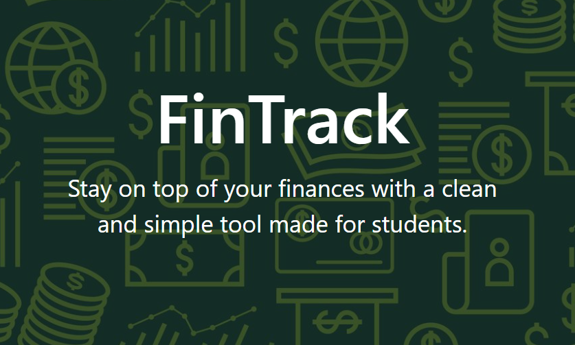

# FinTrack
A simple tool to track your personal finances. Made easy for students. This web app is now mobile responsive. It allows users to input their financial data and see analysis with easy to understand charts.

[Website link](https://fintrack-zobt.onrender.com/)

## How To Use
* Log in or sign up for an account.
* Add transactions by inputting the amount, type, category, and date of transaction.
* View your transactions on the transactions page. Customize the order by clicking "options" and changing the sort order.
* Edit or delete your transactions as needed.
* View your account and balance summary on your dashboard.
* View summaries of your income and expenses over the months or weeks on the analysis page.

## How It Was Made
The website is deployed on `Render`. It also use an external PostgreSQL database on `Supabase`.

This website was coded using `Python`, `JavaScript`, `CSS`, and `HTML`. `Flask` was used to route pages.
`Bootstrap` was also used to style a small part of the website.
The JavaScript library `ChartJS` was also used to generate charts and graphs.
